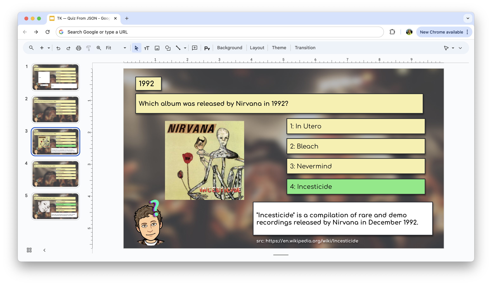

# Google Slides Quiz Generator

This repository contains a Google Apps Script to automatically generate quiz slides in Google Slides from a JSON object containing quiz questions. The script populates slides with questions, options, correct answers, and additional facts.

## Example

Here’s an example image of the generated slides:



## How to Use

1. **Copy the Template Slide**:
   - Use the following Google Slides template: [Template Slide](https://docs.google.com/presentation/d/14Jo4CA1iitcDlZ3-iWgVylAhnuQ08oYXS9Ow76bBFqg/).

2. **Adjust Styles**:
   - Customize the template slide to match your desired styles. Ensure that placeholders for `Year`, `Question`, `Variant 1`, `Variant 2`, `Variant 3`, `Variant 4`, `Fact`, `Source`, and `Answer` are present.

3. **Open Google Apps Script**:
   - In your Google Slides presentation, navigate to `Extensions > Apps Script`.

4. **Paste the Code**:
   - Open the `fillSlidesWithJson.js` file from this repository and copy its content.
   - In the Apps Script editor, replace any existing code with the copied script. Adjust the questions in the JSON object if needed.

5. **Authorize the Script**:
   - When running the script for the first time, you will need to authorize it to access your Google Slides. Follow the prompts to grant the necessary permissions.

6. **Run the Script**:
   - Run the `fillSlidesWithJson` function from the Apps Script editor. The script will generate the quiz slides based on the questions in the JSON object.

## JSON Format

You can ask ChatGPT to help you convert your files to JSON format suitable for this script. Here’s an example JSON structure:

```json
{
  "questions": [
    {
      "year": 1992,
      "question": "Which album was released by Nirvana in 1992?",
      "options": ["In Utero", "Bleach", "Nevermind", "Incesticide"],
      "correct_answer": "Incesticide",
      "fact": "\"Incesticide\" is a compilation of rare and demo recordings released by Nirvana in December 1992.",
      "source": "https://en.wikipedia.org/wiki/Incesticide"
    },
    {
      "year": 1993,
      "question": "Who released the album \"Music Box\" in 1993?",
      "options": ["Whitney Houston", "Mariah Carey", "Madonna", "Janet Jackson"],
      "correct_answer": "Mariah Carey",
      "fact": "\"Music Box\" was Mariah Carey's third studio album and included hits like \"Dreamlover\" and \"Hero\".",
      "source": "https://en.wikipedia.org/wiki/Music_Box_(Mariah_Carey_album)"
    }
  ]
}
```

## Note

- Images on slides are fetched from site thumbnails. Using Wikipedia articles as sources is recommended for better image quality.

## Additional Help

- You can ask ChatGPT to generate questions or convert your data to the required JSON format. ChatGPT can also assist with any further customizations or troubleshooting.

## Script File

The script file `fillSlidesWithJson.js` contains the full script. Copy the content from this file and paste it into the Google Apps Script editor in your Google Slides presentation. Adjust the JSON data and script logic as needed for your specific requirements.
